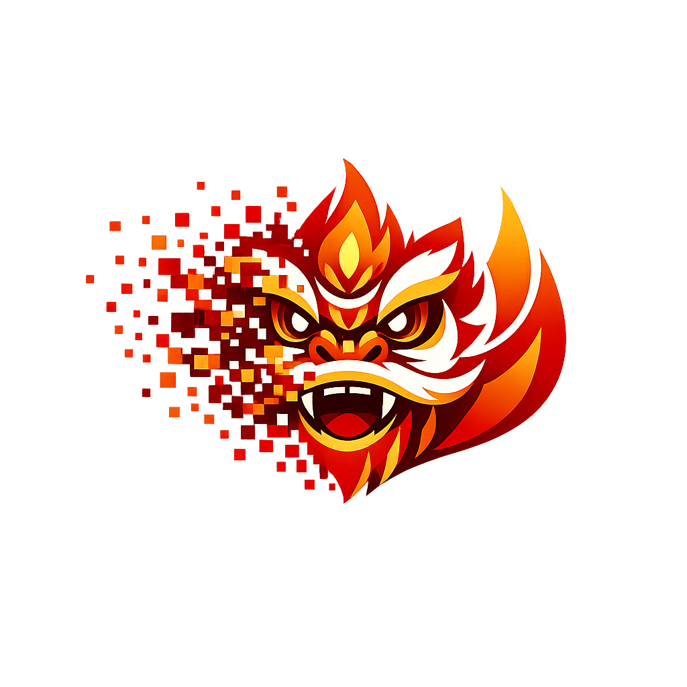
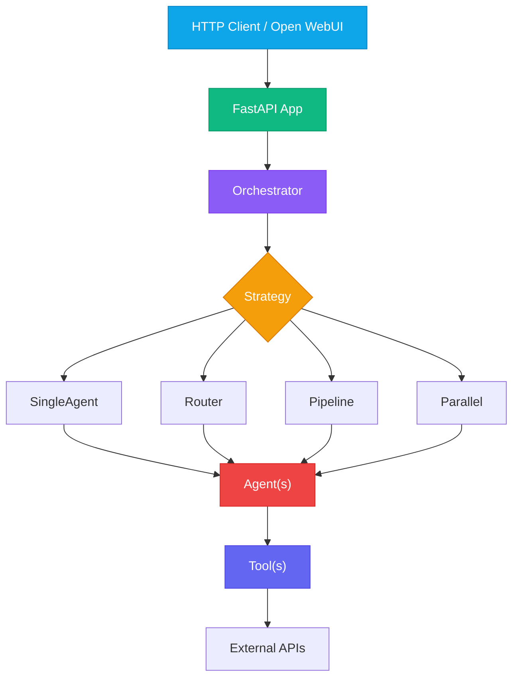

<div align="center">

<!-- TODO: Replace with your logo once ready (SVG or wider banner) -->


# Barongsai

**Production-ready Python AI agent framework with async-first design, enterprise middleware, and modular architecture.**

[](https://python.org)
[](https://fastapi.tiangolo.com)
[](LICENSE)
[](#docker)

[](https://github.com/deduu/barongs.ai/stargazers)
[](https://github.com/deduu/barongs.ai/issues)
[](https://github.com/deduu/barongs.ai/commits/main)

[Getting Started](#quick-start) | [Docker Setup](#docker) | [Architecture](#architecture) | [API Reference](#openai-compatible-api-reference) | [Development](#development)

</div>

---

## Demo

<div align="center">

https://github.com/user-attachments/assets/add862dd-8c90-4d25-a680-1db09a048c38

_Search agent running in Open WebUI — web research with cited synthesis_

<!-- TODO: Add a CLI demo GIF if desired -->
<!--  -->

</div>

---

## Features

<table>
<tr>
<td width="33%" valign="top">

### Core Framework

- Abstract Agent, Tool, Memory, Orchestrator
- Strategy pattern: SingleAgent, Router, Pipeline, Parallel
- Frozen immutable contexts
- Pydantic v2 validation everywhere

</td>
<td width="33%" valign="top">

### Enterprise Middleware

- Circuit breakers on all external calls
- Rate limiting per endpoint
- API key authentication
- Structured logging (structlog)
- Configurable timeouts

</td>
<td width="33%" valign="top">

### LLM & Integrations

- OpenAI, Azure, Ollama, vLLM
- HuggingFace local models (4/8-bit)
- MCP tool integration
- OpenAI-compatible API
- SSE streaming

</td>
</tr>
</table>

---

## Quick Start

### Prerequisites

- **Python 3.11+**
- [uv](https://docs.astral.sh/uv/) (recommended) or pip
- [Docker](https://docs.docker.com/get-docker/) (for the full stack)

### Installation

```bash
git clone https://github.com/deduu/barongs.ai.git
cd barongs.ai

# Install with uv (recommended)
uv sync

# Or with pip
pip install -e ".[dev]"

# For local HuggingFace models (requires GPU)
pip install -e ".[local]"
```

### Configuration

```bash
cp .env.example .env
# Edit .env — set at minimum: BGS_LLM_API_KEY
```

### Run Locally

```bash
# Search agent (Perplexity-style chatbot)
uvicorn src.applications.search_agent.main:app --reload --port 8000

# Example app (minimal reference)
uvicorn src.applications.example_app.main:app --reload --port 8000
```

---

## Docker

Start the full stack — **Barongsai + Open WebUI + PostgreSQL + Redis** — in one command:

```bash
cp .env.example .env
# Edit .env — set at minimum: BGS_LLM_API_KEY

docker compose up --build
```

| Service           | URL                                              | Purpose              |
| :---------------- | :----------------------------------------------- | :------------------- |
| **Open WebUI**    | [`http://localhost:3000`](http://localhost:3000) | Chat interface       |
| **Barongsai API** | [`http://localhost:8000`](http://localhost:8000) | Search agent backend |
| **PostgreSQL**    | `localhost:5432`                                 | Persistent storage   |
| **Redis**         | `localhost:6379`                                 | Caching layer        |

Open WebUI is pre-configured to connect to Barongsai. Once all containers are healthy, open [`http://localhost:3000`](http://localhost:3000) and start chatting.

<details>
<summary><b>Configuration options</b></summary>

**Run the example app instead:**

```
BGS_APP_MODULE=src.applications.example_app.main:app
```

**Customize database credentials:**

```
POSTGRES_USER=barongsai
POSTGRES_PASSWORD=barongsai
POSTGRES_DB=barongsai
```

</details>

<details>
<summary><b>Setting up Open WebUI manually</b></summary>

If you already have Open WebUI running separately:

1. Start Barongsai (locally or via Docker)

2. Open the **Open WebUI admin panel** — go to **Settings > Connections**

3. Add an **OpenAI connection**:
   | Scenario | API Base URL |
   |:---------|:-------------|
   | Open WebUI in Docker, Barongsai on host | `http://host.docker.internal:8000/v1` |
   | Both in the same Docker Compose | `http://barongsai:8000/v1` |
   | Both running directly on host | `http://localhost:8000/v1` |

   **API Key**: value of `BGS_API_KEY` from your `.env` (default: `changeme`)

4. Click the **refresh button** next to the URL field — you should see the model listed

5. **Start chatting** — search queries trigger web research; direct questions get answered immediately

> If `BGS_OPENAI_AUTH_ENABLED` is `false` (default), the API key field in Open WebUI can be any non-empty string.

</details>

---

## Architecture



| Directory           | Purpose                                                                  |
| :------------------ | :----------------------------------------------------------------------- |
| `src/core/`         | Generic framework — interfaces, models, orchestrator, server, middleware |
| `src/applications/` | Concrete apps built on the core framework                                |

Dependencies are unidirectional: `applications -> core`, never `core -> applications`.

> See [docs/ARCHITECTURE.md](docs/ARCHITECTURE.md) for the full deep-dive.

---

## Applications

### Search Agent

> Perplexity-style search chatbot — the flagship application.

| Feature            | Description                                              |
| :----------------- | :------------------------------------------------------- |
| **Query Analysis** | Classifies queries as search vs. direct answer           |
| **Web Research**   | Parallel search via DuckDuckGo (free) or Brave (API key) |
| **Synthesis**      | LLM-powered answers with clickable markdown citations    |
| **Streaming**      | Real-time token streaming via SSE                        |
| **OpenAI API**     | Drop-in `/v1/chat/completions` endpoint                  |

**Endpoints:**

| Method | Path                   | Description                 |
| :----- | :--------------------- | :-------------------------- |
| `POST` | `/api/search`          | Search with cited synthesis |
| `POST` | `/api/search/stream`   | Streaming search with SSE   |
| `POST` | `/v1/chat/completions` | OpenAI-compatible API       |
| `GET`  | `/v1/models`           | List available models       |
| `GET`  | `/health`              | Health check                |

### Example App

Minimal reference app with an `EchoAgent`. Use as a template when building new applications.

---

## OpenAI-Compatible API Reference

```bash
# List available models
curl http://localhost:8000/v1/models

# Chat completion
curl -X POST http://localhost:8000/v1/chat/completions \
  -H "Content-Type: application/json" \
  -d '{
    "model": "gpt-4o",
    "messages": [{"role": "user", "content": "What is FastAPI?"}]
  }'

# Streaming
curl -N -X POST http://localhost:8000/v1/chat/completions \
  -H "Content-Type: application/json" \
  -d '{
    "model": "gpt-4o",
    "messages": [{"role": "user", "content": "What is FastAPI?"}],
    "stream": true
  }'
```

> The `model` field should match `BGS_LLM_MODEL` (default: `gpt-4o`).

---

## Development

```bash
make install    # Install dependencies
make test       # Run tests with coverage
make lint       # Lint with ruff
make typecheck  # Type check with mypy
make format     # Auto-format code
make check      # All checks (lint + typecheck + test)
```

<details>
<summary><b>Project rules</b></summary>

- All I/O must be async
- Pydantic validation on all inputs
- Circuit breakers on all external API calls
- TDD: write tests before implementation
- See [CLAUDE.md](CLAUDE.md) for complete development rules

</details>

---

## Roadmap

Barongsai's core framework (agent orchestration, async I/O, middleware patterns) is solid, but production infrastructure is still in progress. Here's what's done and what's planned:

### Done

- [x] Async-first architecture (httpx, AsyncOpenAI, asyncio throughout)
- [x] Strategy-based orchestrator (SingleAgent, Router, Pipeline, Parallel)
- [x] Circuit breakers on external HTTP tools
- [x] Structured logging with structlog (JSON in production)
- [x] Global exception handlers (429, 503, 504)
- [x] API key authentication via FastAPI dependencies
- [x] Multi-provider LLM support (OpenAI, Azure, Ollama/vLLM, HuggingFace local)
- [x] OpenAI-compatible `/v1/chat/completions` endpoint
- [x] SSE streaming
- [x] Docker Compose stack (app + Open WebUI + Postgres + Redis)
- [x] Pydantic v2 validation on all inputs

### Phase 1 — Production Basics

- [ ] Multi-worker server (gunicorn + uvicorn workers)
- [ ] Wire PostgreSQL with SQLAlchemy async + connection pooling
- [ ] Wire Redis for caching and session storage
- [ ] Distributed rate limiting (Redis-backed, not in-memory)
- [ ] Real health checks (`/ready` verifies DB, Redis, LLM connectivity)
- [ ] Persistent conversation memory (Redis or Postgres-backed)
- [ ] Database migrations with Alembic
- [ ] Non-root Docker user + hardened Dockerfile
- [ ] CORS defaults to explicit origins (not wildcard)

### Phase 2 — Scale & Observability

- [ ] Reverse proxy (Nginx/Traefik) with TLS termination
- [ ] CI/CD pipeline (GitHub Actions: lint, typecheck, test, build, deploy)
- [ ] Circuit breakers on LLM provider calls
- [ ] Request correlation IDs for distributed tracing
- [ ] Error reporting integration (Sentry)
- [ ] Kubernetes Ingress + session affinity
- [ ] Secrets management (sealed-secrets or Vault)
- [ ] Prometheus metrics endpoint

### Phase 3 — Scale to Thousands+

- [ ] Database read replicas and query optimization
- [ ] Message queue for async tasks (Celery/RabbitMQ)
- [ ] Multi-region deployment
- [ ] OAuth2/JWT authentication with scopes
- [ ] Full observability stack (Prometheus + Grafana + ELK)
- [ ] Load testing benchmarks (Locust/k6)
- [ ] Helm chart for Kubernetes

Contributions welcome — pick any unchecked item and open a PR!

---

<div align="center">

## License

[MIT](LICENSE)

</div>
